# 말랑 한국어 · Mallang Korean

A cute, spaced-repetition Korean learning game that runs in your browser.
Meet 말랑이 (Mallang-i), a squishy rice-cake bunny with a sprout on its head:
every Korean word you learn becomes a plant in your **word garden**, and short
practice rounds keep it growing.

- **10 minigames:** 🎴 Word Cards · 🧩 Sentence Builder · ⚡️ Speed Match · 🎈 Balloon Pop · 🧪 Particle Lab · 🪄 Verb Magic · 🏪 Number Shop · 👂 Sound Twins · 🔗 Grammar Cards · 🎧 Dialogues
- **10 topics** with 324 words and 190 sentences, each with short lesson notes: ☕ at the café · 🌞 my day · 👨‍👩‍👧 family & people · 🔢 numbers & time · 🛍️ shopping · 💗 feelings · 🗺️ finding the way · 📔 the past tense · ☔ weather · 🎨 hobbies & plans
- **12 grammar patterns** (-고, -지만, -아서/어서, -(으)면, -(으)니까…) with about 90 practice sentences, and **16 listening dialogues** with two voices
- **Built-in Korean keyboard**, so you never need a Korean input method
- **Pronunciation audio** through your browser's own Korean voice, **dictation** of whole sentences, and **🎤 speaking practice** in Chrome and Edge
- **Streaks, points, levels, an adjustable daily goal, 36 badges** and outfits for the mascot, saved on your computer
- Korean interface with small English subtitles, which you can turn off once you're ready, and a **dark theme**
- Works on **phones** too, and can be **installed as an app** that plays offline

<p align="center">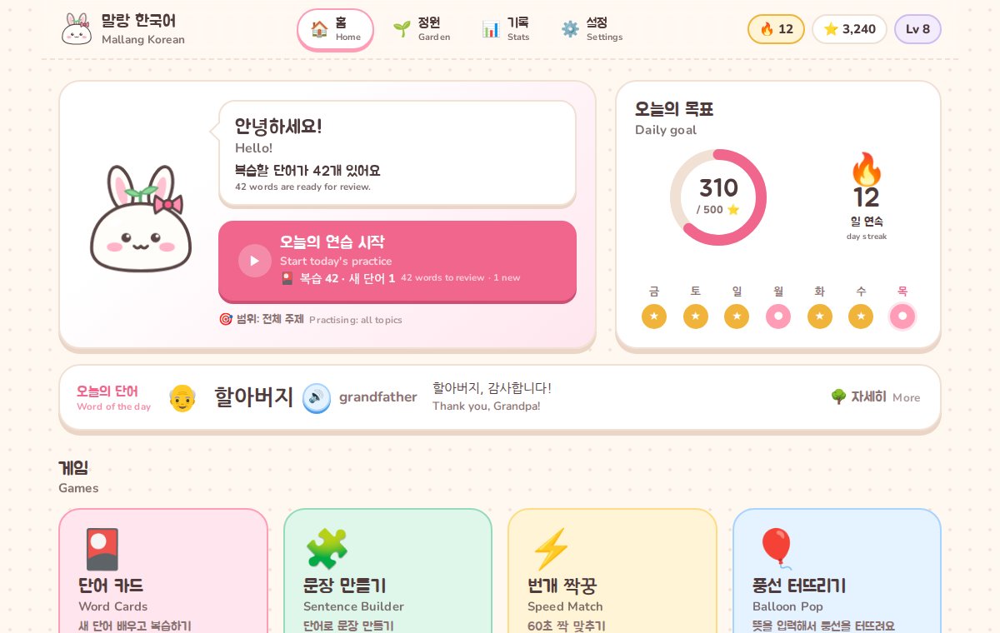</p>

| Meeting a new word | Typing with the built-in keyboard | Feedback that explains the mistake |
| --- | --- | --- |
| 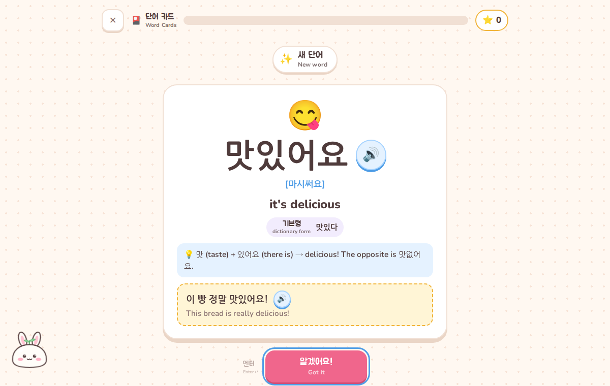 | 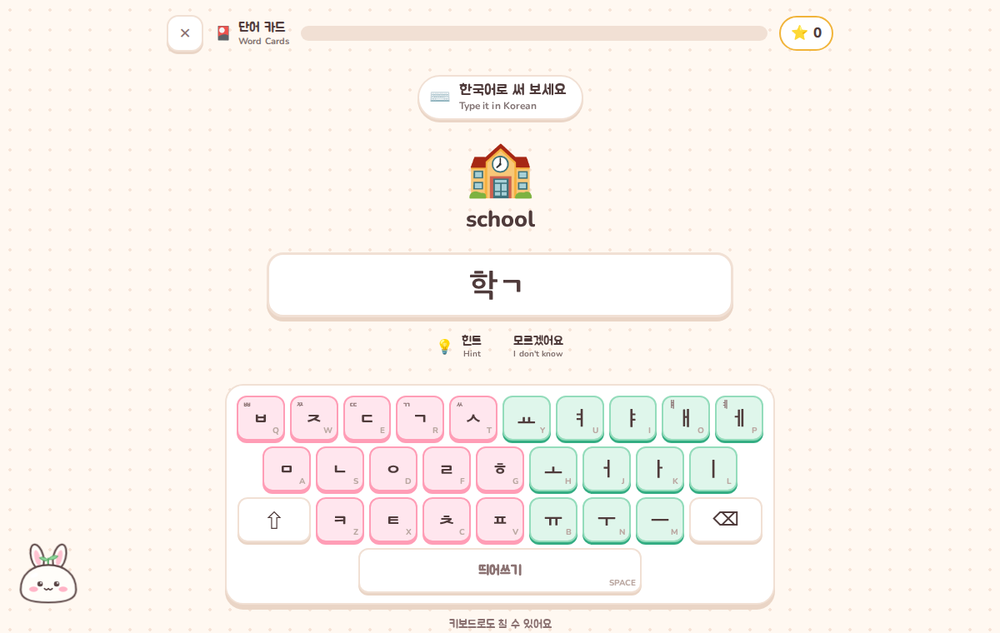 | 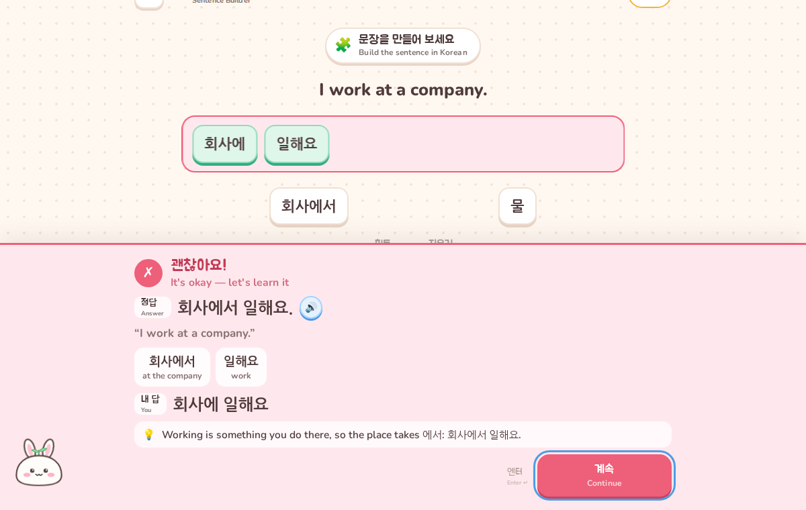 |

| Balloon Pop | Particle Lab | Verb Magic |
| --- | --- | --- |
| 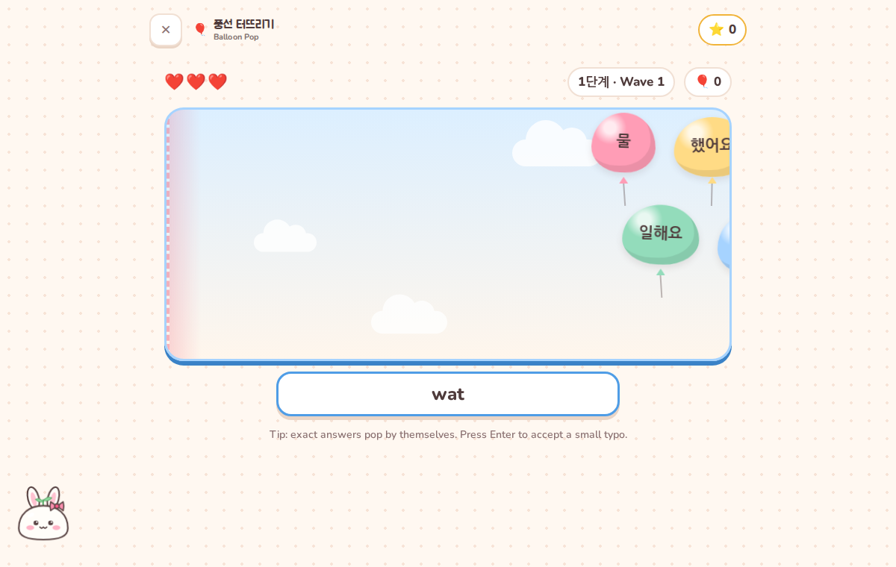 | 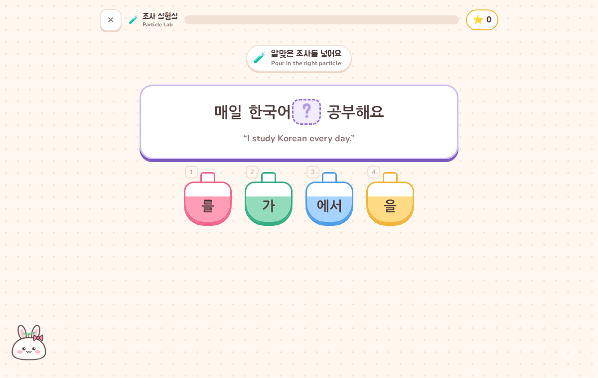 | 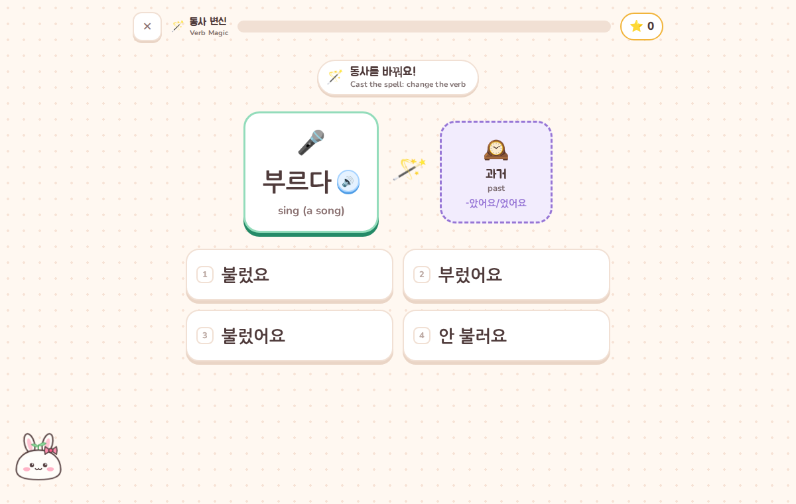 |
| **Number Shop** | **Sound Twins** | **Dark theme** |
| 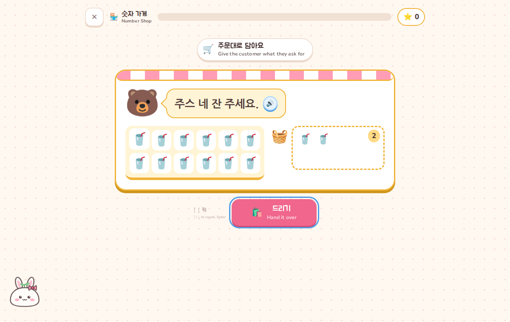 | 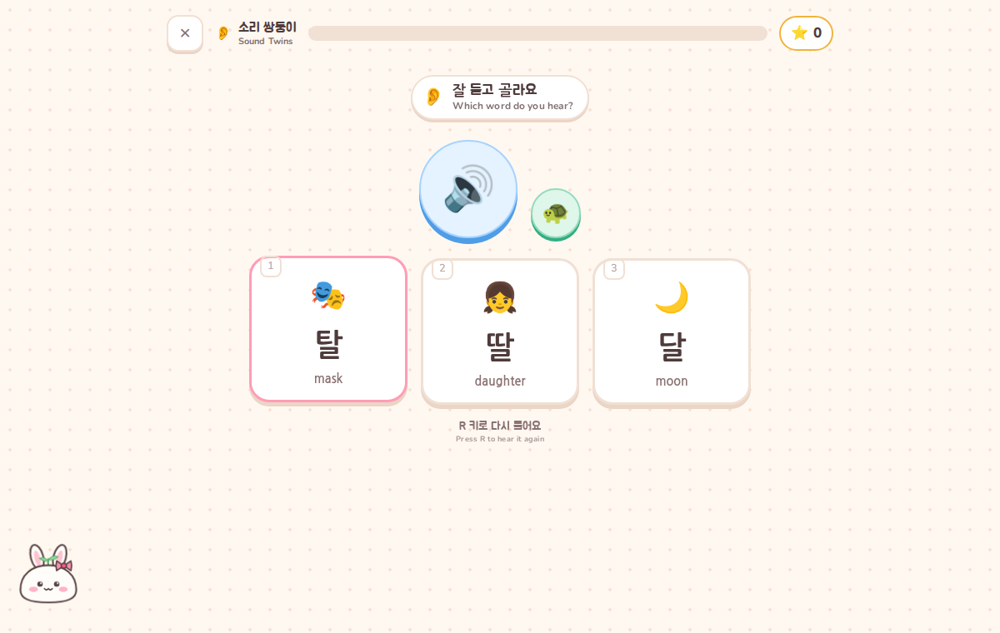 | 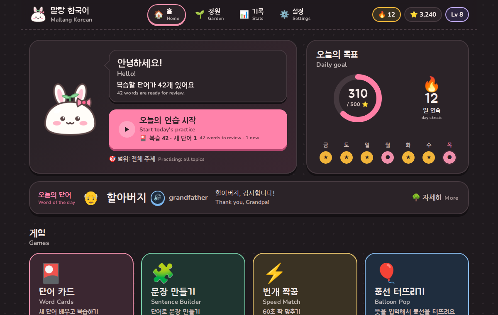 |
| **Grammar Cards** | **Dialogues** | **On a phone** |
| 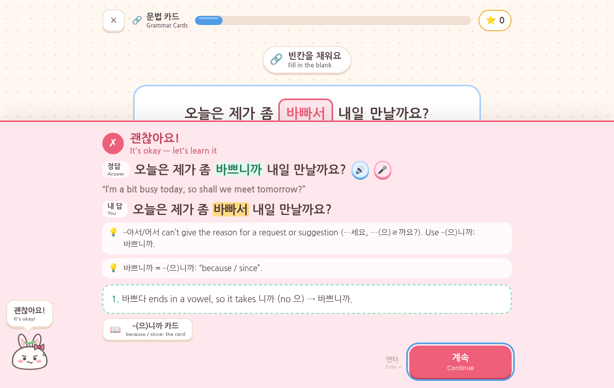 | 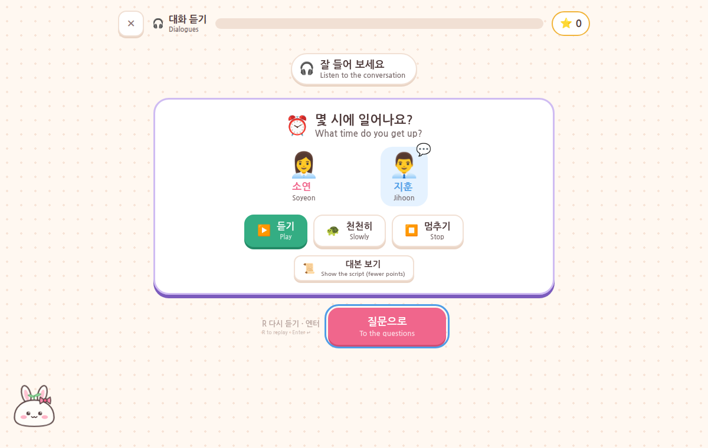 | 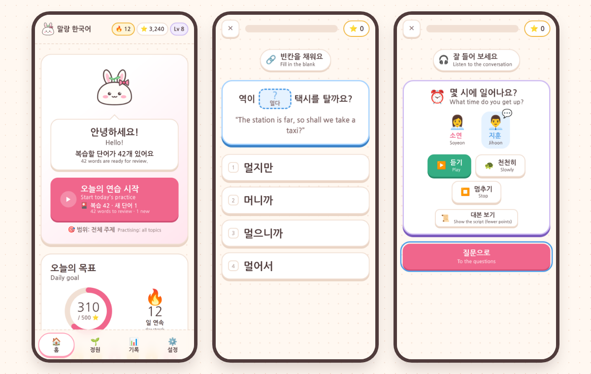 |

## Quick start

1. Download or clone this folder.
2. Double-click **`index.html`**. That's it: no install and no build step.

Google Chrome or Microsoft Edge give the best experience, because they come with Korean voices.

If your browser won't save progress when the page is opened as a file (some browsers
restrict storage for `file://` pages), start a tiny local server in this folder instead:

```bash
python3 -m http.server 8000      # then open http://localhost:8000
# or:  npm start  /  npx serve
```

To play on your phone, or offline, install it as an app: see [Install as an app](#install-as-an-app-and-play-offline).

## How it teaches

The game follows a few well-established ideas about learning vocabulary:

| Idea | How the game does it |
| --- | --- |
| **Spaced repetition** | Each word has a review date. Get it right and it waits longer (10 min → 1 day → 3 days → 1 week → 16 days → months). |
| **Missed words come back sooner** | A wrong answer drops the word two stages, makes it due right away and lowers its "ease", so it keeps returning until it sticks. It is also asked again a few cards later in the same round. Words you missed recently are marked 🥀 *tricky*. |
| **Active recall, step by step** | How you're asked depends on how well you know the word: 🌱 recognise it → 🌿 pick or hear the Korean → 🌷 build it from syllable tiles → 🌻 type it from memory. |
| **New + old, mixed** | Each Word Cards round mixes due reviews with a few new words. The number of new words shrinks when many reviews are waiting, and there's a daily cap (20 by default, adjustable in Settings), so reviews never pile up. Within a level, words come one topic at a time, so their sentences open up quickly. |
| **Your starting level** | You pick your level at the start (A1 / low A2 / A2). Words below it aren't thrown away: they come up as quick checks, 8 a day. Miss one and it goes back into your learning queue, so the gaps in what you know get found and filled. |
| **Immediate feedback that explains** | After every answer you see the correct answer, what you gave, and why it's wrong: e.g. *"ㄸ is tense: a tight sound with no puff of air"*, *"커피 ends in a vowel, so it takes 를"*, *"Working is something you do there, so the place takes 에서"*. |
| **Sentences only with words you know** | A sentence unlocks once you've learned all of its words. |
| **Grammar you can see** | Particle Lab turns your sentences into "which particle?" questions (을/를, 이/가, 에/에서, (으)로…), and Verb Magic drills verb forms (past, future, negative, "want to"…). The wrong options are the mistakes learners really make (`듣어요`, `먹아요`, `안 공부해요`), each with the reason, and every answer shows how the form is built. |
| **Train your ear** | Sound Twins plays one of two or three look-alike words (달 / 탈 / 딸, 거울 / 겨울, 반 / 방 / 밤) so you learn to hear the difference. Well-known sentences are sometimes dictated for you to write down. |
| **Practice counts everywhere** | The fast games (Speed Match, Balloon Pop, Particle Lab, Verb Magic, Number Shop) use the words and sentences you've learned: a slip marks that word or sentence as tricky, so Word Cards and the Sentence Builder bring it back soon. |
| **A daily goal that means real practice** | Presets from 250 ⭐ (about 6 minutes) to 1200 ⭐ (about 30), or any amount on a slider in Settings. |
| **Grammar in real sentences** | Grammar Cards teaches the endings that join ideas (-고, -지만, -아서/어서, -(으)면, -(으)니까, -(으)러, -(으)ㄹ 때, -기 전에, -(으)ㄴ 후에) and the helpers for "can", "must" and "may". Each pattern starts with a card (meaning, how to make it with a table of forms, a note, examples), then you fill the blank in real sentences. The wrong options are the same word with another ending (a different meaning: `오면` "if it rains" vs `오니까` "because it's raining") and the slips learners really make (`먹아서`, `듣으면`, `가을 때`), each explained. Every pattern has its own review schedule. |
| **Listening to real conversations** | Dialogues plays short two-person conversations (ordering, asking the way, making plans…) with two different voices and the script hidden, then asks about them. After each answer you see the line that holds it; at the end, the whole script with translations. Reading the script first is allowed, for fewer points. |

### The minigames

- **🎴 단어 카드 · Word Cards**: the main loop. New words get an introduction card (audio, pronunciation notes like `[감사함니다]`, dictionary form, an example sentence), then they're quizzed a few cards later. Keys: `1`–`4` pick an answer, `Enter` continues, `R` replays audio.
- **🧩 문장 만들기 · Sentence Builder**: tap word tiles in order to build a Korean sentence. The decoy tiles are real traps: wrong particles (`커피을`), 에 vs 에서, 둘 vs 두 before a counter. Well-known sentences switch to listening mode ("build what you hear").
- **⚡️ 번개 짝꿍 · Speed Match**: match Korean words to their meanings against a 60-second clock. Tricky and due words appear first; a mismatch sends that word back to Word Cards for a proper review. It unlocks after you've learned 6 words.
- **🎈 풍선 터뜨리기 · Balloon Pop**: Korean words float across the sky as balloons. Type what they mean in English before they reach the left side; an exact answer pops the balloon by itself, and `Enter` also accepts a small typo. Every 5 pops the wind gets stronger, 3 balloons that get away end the round, and 10 waves clear the sky. **Reverse mode** shows English balloons that you pop by typing the Korean on the built-in keyboard.
- **🧪 조사 실험실 · Particle Lab**: a sentence you know with one particle missing: pour in the right potion (을 or 를? 에 or 에서?). Wrong potions explain themselves, and the right one comes with its rule.
- **🪄 동사 변신 · Verb Magic**: a verb you've learned and a spell: present, past, negative, then later the future, "want to", "shall we?" and "please do it". Pick the right form (or type it, for verbs you know well) and see how it's built step by step, including the irregular verbs (들어요, 추워요, 몰라요…).
- **🏪 숫자 가게 · Number Shop**: run a little shop. Hand over "사과 세 개", read a price tag aloud (팔천오백 원), ring up the amount a customer says on the till, and tell the time (세 시 반). Native vs Sino-Korean mix-ups (삼 시, 셋 개) are the wrong answers, each explained.
- **👂 소리 쌍둥이 · Sound Twins**: hear a word and find it among its look-alike twins, from plain / aspirated / tense consonants to vowels and final consonants. Without a Korean voice it becomes a reading warm-up (romanization → Hangul).
- **🔗 문법 카드 · Grammar Cards**: one new pattern at a time (two a day at most), each introduced with its card, then practised in fill-the-blank sentences next to the patterns you already know. Sentences whose words you've learned come first, and a missed pattern comes back sooner. The 📖 button in the feedback, the garden and the summary reopen a pattern's card. It opens once you know 15 words.
- **🎧 대화 듣기 · Dialogues**: two conversations a round. ▶ plays the whole dialogue (🐢 slowly), `R` replays it, and every line in the script has its own 🔊. A dialogue opens once you know its key words, and the ones you found hard come back sooner. Without a Korean voice it becomes reading practice.

**Dictation and speaking.** Sentences you know well are sometimes dictated in the Sentence Builder: listen and write the whole sentence (spaces and punctuation don't matter). In Chrome and Edge, 🎤 buttons next to new words and answers let you say them out loud: the browser's speech recognition checks how close you were. Both can be switched off in Settings.

## Typing Korean

Typing exercises use the on-screen **2-set (두벌식)** keyboard, the standard Korean layout.
You can click the keys, or use your **own keyboard as it is**: the game reads the key
*positions*, so no Korean input method is needed. **R** is ㄱ, **K** is ㅏ, **Shift + R** is ㄲ, and so on. The letters
combine into syllables automatically (ㄱ + ㅏ + ㄴ → 간), and Backspace removes one letter at a time.
The small Latin letters on the keys can be hidden in Settings.

## Audio

Pronunciation uses the browser's built-in speech synthesis (`speechSynthesis`) with a Korean voice,
picking the most natural one it can find. You can choose a voice and the speed in **Settings**.

If no Korean voice is installed, the game keeps working without sound: 🔊 buttons turn grey,
and the game explains how to add a voice:

- **Easiest:** use Chrome or Edge, which include online Korean voices.
- **Windows:** Settings → Time & language → Speech → Manage voices → Add voices → Korean, then restart the browser.
- **macOS:** System Settings → Accessibility → Spoken Content → System voice → Manage Voices… → Korean (e.g. Yuna).

Speaking practice uses the browser's speech recognition (`SpeechRecognition`), which Chrome and Edge provide. It
needs a microphone, and Chrome sends the audio to its online speech service to recognise it. In browsers without
it, the 🎤 buttons simply don't appear.

## Install as an app (and play offline)

When the game is opened from a web address rather than as a file, it can be installed like an app,
with its own icon and window, and it keeps working offline (a service worker, `sw.js`, keeps a copy
of every file). Browsers only allow this from a web address:

1. Put this folder on any static web host (for example GitHub Pages), or run `npm start`
   (`python3 -m http.server 8000`) and open http://localhost:8000 on the same computer.
2. Install it:
   - **Chrome / Edge (computer or Android):** **Settings → App → Install the app** in the game, or the
     install icon in the address bar (Android: menu ⋮ → *Install app* / *Add to Home screen*).
   - **iPhone / iPad (Safari):** Share → *Add to Home Screen*.

On a phone, the menu moves to a tab bar at the bottom and the games fit the screen. Opened as a file
(`index.html` double-clicked), the game works exactly the same, just without the install option.

## Your progress

Everything (garden, streak, points, badges, settings) is saved automatically in your browser's
`localStorage`. In **Settings → Your data** you can download a backup file, restore it (for example
on another computer), or reset everything. Progress is kept separately for each way of opening the
game (as a file, from a web address, as the installed app), so use a backup to move it from one to another. Older saves are upgraded automatically: when new topics are
added, words below your starting level become quick checks, a few a day.

Settings also has the theme (light, dark, or like your computer), the daily goal, how many new words a day
Word Cards may introduce, and speaking practice. 말랑이 gets a new outfit every few levels: pick one in the
wardrobe on the Stats screen.

## Adding content

Each topic is one file in `content/`. To add a topic:

1. Copy `content/cafe.js` to e.g. `content/weather.js` and change the `id`, title and words.
2. Add `<script src="content/weather.js"></script>` next to the other topics in `index.html`.
3. Run the tests (below): they catch most authoring mistakes.

```js
Mallang.content.registerTopic({
  id: 'weather',                       // ids are namespaced automatically: 'weather:rain'
  order: 3,
  emoji: '☔', color: 'sky',           // colours: pink, mint, butter, sky, lilac
  title: { ko: '날씨', en: 'Weather' },
  description: { ko: '날씨 이야기', en: 'Talk about the weather' },
  notes: [
    { title: { ko: '-네요', en: 'Noticing something' },
      text: 'Add **-네요** when you notice something: 춥네요! (It’s cold!)',
      examples: [{ ko: '비가 오네요.', en: 'Oh, it’s raining.' }] },
  ],
  words: [
    { id: 'rain', ko: '비', en: 'rain', level: 1, pos: 'noun', emoji: '🌧️', rom: 'bi',
      example: { ko: '비가 와요.', en: 'It’s raining.' } },
    { id: 'cold', ko: '추워요', en: "it's cold", level: 1, pos: 'adjective', emoji: '🥶', rom: 'chuwoyo',
      dict: '춥다', note: 'ㅂ-irregular: 춥 + 어요 → 추워요.',
      example: { ko: '오늘 추워요.', en: 'It’s cold today.' } },
  ],
  sentences: [
    { id: 's-rain', en: 'It is raining today.', ko: '오늘 비가 와요.',
      tiles: ['오늘', '비가', '와요'], gloss: ['today', 'rain (subject)', 'comes'],
      words: ['rain', 'day:today', 'day:come'],   // other topics' words: 'topic:id'
      traps: [{ tile: '비를', why: 'Rain is the subject here, so it takes 가: 비가 와요.' }] },
  ],
});
```

**Word fields:** `id`, `ko`, `en` and `level` (1 = A1, 2 = low A2, 3 = A2) are required. Optional:
`pos`, `emoji`, `rom` (romanization), `pron` (pronunciation in Hangul when it differs from the spelling),
`dict` (dictionary form of a verb), `note`, `example`, `accept` (other answers to accept when typing),
`avoid` (ids of words so close in meaning that they must never be offered as this word's wrong answers,
e.g. 차 "tea" and 녹차 "green tea"), `enAlt` (more English answers to accept when the meaning is typed in
Balloon Pop, e.g. `['to go', 'takeaway']`), and `form` (`'past'`, `'future'` or `'want'` for words that aren't
in the present tense, like 갔어요). Verb forms are checked against the conjugation engine by the tests.

**Sentence fields:** `en`, `ko`, `tiles` (the answer, in order), `words` (the words it uses; it unlocks
once they're learned). Optional: `gloss` (English for each tile), `traps` (tempting wrong tiles with an
explanation), `alts` (other correct word orders), `drill: false` (keep the sentence out of Particle Lab).
Particle traps like `커피을` for `커피를` are generated automatically, and so are the Particle Lab questions.

**Sound Twins** sets live in `content/sounds.js`: real words that differ in one sound, e.g.
`{ id: 'dal', words: [{ ko: '달', en: 'moon', emoji: '🌙', rom: 'dal' }, { ko: '탈', en: 'mask', emoji: '🎭', rom: 'tal' }] }`.
The game works out which letter differs and explains it.

**Grammar patterns** live in `content/grammar.js`. A question only names the word and the ending; the grammar
engine (`js/core/grammar.js`) makes the form, checks it against `answer`, and builds the wrong options with
their explanations: the same word with the endings in `contrast` (a different meaning, which the English
must make clear) and the typical slips for that word (`먹아서`, `들으면` vs `듣으면`…). `traps` adds
hand-written wrong options:

```js
{ id: 'nikka', order: 8, level: 3, emoji: '👉', form: 'nikka',
  title: { ko: '-(으)니까', en: 'because / since' },
  meaning: '…', how: '…', note: '…', examples: [{ ko: '…', en: '…' }],
  questions: [
    { id: 'umbrella', ko: '비가 오니까 우산을 가져가세요.', en: 'It’s raining, so take an umbrella.',
      answer: '오니까', dict: '오다', words: ['weather:rain', 'weather:umbrella'],
      contrast: ['myeon', 'jiman'],
      traps: [{ text: '와서', why: '-아서/어서 can’t give the reason for a request (…세요). Use -(으)니까: 오니까.' }] },
    // pos: 'adjective' for adjectives, tense: 'past' for 갔지만 / 먹었으니까 / 갔을 때
  ] },
```

The endings are `go` -고 · `jiman` -지만 · `aseo` -아서/어서 · `myeon` -(으)면 · `nikka` -(으)니까 · `reo` -(으)러 ·
`ttae` -(으)ㄹ 때 · `gijeone` -기 전에 · `hue` -(으)ㄴ 후에 · `aya` -아/어야 해요 · `ado` -아/어도 돼요 · `su` / `suNot`
-(으)ㄹ 수 있어요 / 없어요. The tests check that every answer matches the engine and that every question has
three explained wrong options.

**Dialogues** live in `content/dialogues.js`: two speakers (one `voice: 'high'`, one `'low'`), a few lines,
and questions whose options are `{ ko, en }` and whose `line` points at the line with the answer:

```js
{ id: 'cafe-order', topic: 'cafe', level: 1, scene: '☕', title: { ko: '카페에서 주문하기', en: 'Ordering at a café' },
  speakers: { A: { name: '직원', en: 'Barista', emoji: '🧑‍🍳', voice: 'low' },
              B: { name: '서연', en: 'Seoyeon', emoji: '👩', voice: 'high' } },
  lines: [{ who: 'A', ko: '어서 오세요. 뭐 드릴까요?', en: 'Welcome! What can I get you?' }, …],
  words: ['cafe:latte', 'cafe:cake'],          // it opens once these are learned
  questions: [{ q: { ko: '서연 씨는 뭘 마셔요?', en: 'What does Seoyeon drink?' },
                options: [{ ko: '라테', en: 'a latte' }, { ko: '녹차', en: 'green tea' }, { ko: '주스', en: 'juice' }],
                answer: 0, line: 1, why: 'Seoyeon says 라테 한 잔하고 쿠키 하나 주세요.' }] },
```

Write numbers in the lines in Hangul (세 시 반, 사천오백 원), so every voice reads them right.

## Adding a minigame

A minigame is one file in `js/games/` that registers itself; add its `<script>` tag in `index.html`
and it appears on the home screen.

```js
Mallang.games.register({
  id: 'my-game',
  order: 4,
  emoji: '🎯', color: 'sky',
  title: { ko: '내 게임', en: 'My Game' },
  blurb: { ko: '설명', en: 'What it does' },
  status(topicId) {           // shown on the home card
    return { ready: true, ko: '도전!', en: 'Try it' };
  },
  start(host) {
    // host.stage             element to draw into
    // host.topicId           the chosen topic ('all' or a topic id)
    // host.setProgress(d, t) progress bar
    // host.award(points)     add points (updates goal, streak, level)
    // host.react(result, combo)  sound + mascot reaction to { correct, almost }, combo counter
    // host.showFeedback({ tone, points, content, onContinue })
    // host.empty({ emoji, ko, en, text })   friendly "nothing to do / locked" card
    // host.onCleanup(fn)     called when the player leaves
    // host.finish(result)    end of round → summary screen ({ gameId, answers, correct, bestCombo,
    //                        mistakes, mainStat: { icon, value, ko, en } to replace the accuracy tile })
  },
});
```

Games can reuse the exercise types in `js/exercises/` (`intro`, `choice`, `tiles`, `typing`,
`sentence`, `dictation`), the spaced-repetition helpers in `js/core/srs.js` (`practice(id, correct)`
is the light update the fast games use), and the language engines: `M.numbers` (Korean number
readings), `M.conjugate` (verb forms with explanations and typical mistakes), `M.grammar` (connecting
and helper endings, with slips and meaning contrasts), `M.particles` (particle questions from sentences)
and `M.answers` (lenient checking of typed answers). `js/games/word-cards.js`
is a good example to copy; `js/games/particle-lab.js` is a small one.

## Project structure

```
index.html            loads everything (plain <script> tags, so it runs from file://)
css/                  base (tokens, light and dark theme, layout), components, screens, games, minigames,
                      phone (small screens, loaded last)
content/              one file per topic: words, sentences, lesson notes; sounds.js: Sound Twins sets;
                      grammar.js: grammar patterns; dialogues.js: listening dialogues
js/core/              no UI: config, Hangul engine, numbers, verb conjugation, grammar endings, particles,
                      answer checking, storage, spaced repetition, progress & badges, distractor picking,
                      speech, speech recognition, sound effects
js/ui/                components, mascot (and its outfits), Korean keyboard, feedback sheet, 🎤 buttons
js/exercises/         intro · choice · tiles · typing · sentence · dictation
js/games/             word-cards · sentence-builder · speed-match · balloon-pop · particle-lab ·
                      verb-magic · number-shop · sound-twins · grammar-cards · dialogues
js/screens/           onboarding · home · garden · stats · settings · play · summary
js/pwa.js             install & offline support (only when opened from a web address)
js/app.js             start-up and routing (#/home, #/play/word-cards…)
sw.js                 service worker: keeps a copy of every file for offline play
manifest.webmanifest  app name, icons and colours for installing (icons/ holds the icons)
tests/                unit tests for the core and the content (Node's built-in runner)
```

All tunable numbers (review intervals, round sizes, points, daily goals) are in `js/core/config.js`.

## Tests

The core logic and the content have unit tests that use Node's built-in test runner (Node 18+), with no packages to install:

```bash
npm test          # or: node --test tests/*.test.js
```

They cover the Hangul typing engine, Korean numbers, the verb conjugation engine and the grammar
endings (both checked against hand-verified tables of regular and irregular verbs, including the
typical slips), particle questions, answer checking, spaced-repetition scheduling and round building,
the minigames' round logic, streaks, levels, badges, saving, loading and upgrading old saves, and the
offline file list. They also check every topic, grammar pattern and dialogue for authoring mistakes
(including that every verb form and every grammar answer matches the engines).

## Why plain JavaScript?

The game should open straight from a file with no setup. Modern JavaScript *modules*
are blocked on `file://` pages in Chrome and Firefox, so the game uses classic `<script>` tags that
each add a piece to one global `Mallang` object. It's still organised into small modules with
registries for content, exercises and games, so it can grow without a framework or a build step.
The only external resource is an optional web font (Jua + Nunito from Google Fonts). Offline, your
system fonts are used and everything still works. Installing and the offline copy use a service worker,
which browsers only allow from a web address, so that part simply switches itself off on `file://`.

## Ideas for next steps

- Role-play in Dialogues: take one speaker's part and say their lines with 🎤
- More grammar patterns: -고 있어요, -아/어 보다, -(으)ㄹ게요, -는데, and the polite -(으)세요 / -(으)시-
- A short reading passage for each topic, with questions (for when the dialogues feel easy)
